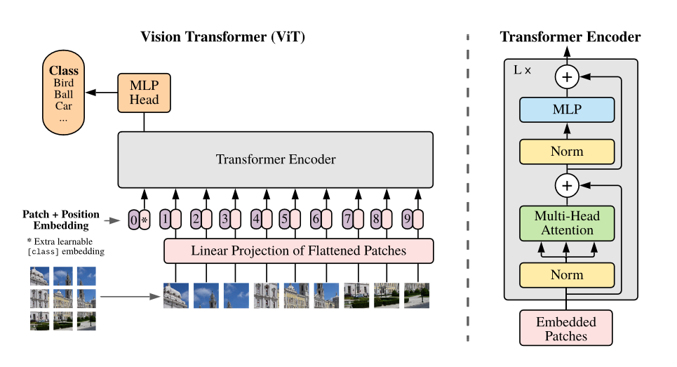

# Vision Transformer - NumPy
This is a NumPy implementation of the [Vision Transformer](https://openreview.net/pdf?id=YicbFdNTTy) (ViT) and runs on CPU.The implementation faithfully replicates the functionality provided by PyTorch implementation.

Since its introduction, the Vision Transformer has inspired numerous follow-up works and adaptations, achieving impressive results on various computer vision benchmarks, surpassing the performance of the state-of-the-art CNN-based models.

In pursuit of trying to understand ViT better we found no earlier work showcasing backward propagation along with forward propagation.

Overall, we observe following advantages of implementing ViT in NumPy.
* Helps to understand the underlying mathematics and avoid falling into the trap of abstracting away the learning process.
* There is no need for 245 MB of PyTorch.

## Dataset:
For sake of simplicity the code uses MNIST dataset as from [here](http://ldaplusplus.com/files/mnist.tar.gz)

## Training
The model trained in the code is currently not saved. Loss and metrics are provided.

### Usage:
Python 3.7.0 is used.
1. Install packages using `pip install -r requirements.txt`
2. Update the following arguments in main.py and execute training `python src/main.py`
   * input_path              : Path to the input folder containing mnist_test.npy and mnist_train.npy
   * batch_size              : Batch size 
   * epochs                  : Total Number of training epochs
   * test_epoch_interval     : Interval for running test set

## Testing Numpy Implementation
Unit tests are available for submodules and can be run using `python -m unittest discover test/`. Forward and backward propagation implemented in NumPy is benchmarked against PyTorch here.
